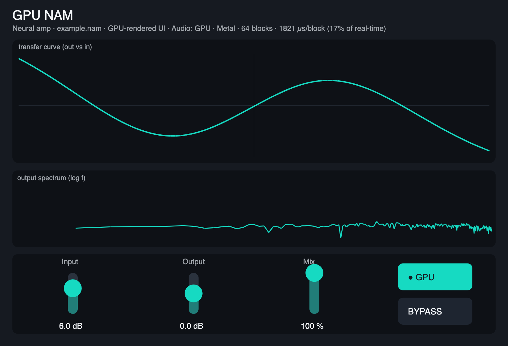

# GPU NAM

A [Neural Amp Modeler](https://github.com/sdatkinson/neural-amp-modeler) (`.nam`) player that runs amp captures on the **GPU**, built on [Pulp](https://github.com/danielraffel/pulp). Signed and notarized for macOS (Apple Silicon).

> Temporary distribution repo for sharing preview builds. The source lives in the Pulp repo (`examples/gpu-nam`).

## What it is

Load a `.nam` capture — the neural "fingerprint" of a guitar amp — and GPU NAM runs its WaveNet inference to reamp your signal through that amp. It runs the network on the **CPU by default**, with an opt-in **GPU engine** that runs the exact same model on the GPU. A small example model is bundled so it works out of the box; load your own `.nam` files for real amp tones.

## An honest take on neural amps on the GPU

This is the case the skeptics are usually right about — and the one place the conventional wisdom is *wrong* if you do it correctly.

**Done naively, GPU neural-amp inference is terrible.** If you run the network one sample at a time, every sample pays a CPU↔GPU round-trip (hundreds of microseconds against ~0.1 µs of actual work) — thousands of times slower than the CPU. That's why "run NAM on the GPU" has a bad reputation.

**Done right, it wins — and the win grows with model size.** Two things make it work:
1. **Block-parallel** — a WaveNet is *feedforward* (each output depends on past *inputs*, never past outputs), so a whole audio block's samples are computed **in parallel**, not in a sample-by-sample loop.
2. **Fusion** — the entire network forward pass runs in **one GPU submit** with the weights and activations resident on the device, so the round-trip is paid **once per block**, not per layer or per sample.

The result: a **standard** capture runs comfortably in real time on either engine (the GPU with headroom), and for **large, high-quality captures the GPU pulls far ahead** — the regime where the CPU starts to struggle to run the model in real time at all.

### Measured (Apple Silicon / Metal)

GPU inference is validated **bit-for-bit** against the CPU reference (cross-correlation = 1.0, max difference ≈ 2×10⁻¹⁰ — same audio, just faster), single-block and streaming.

| Model size | per-block: CPU | per-block: GPU | result |
|------------|---------------:|---------------:|--------|
| standard (≈16 ch) | real-time | real-time, headroom to spare | both fine; GPU has room |
| large (48 ch, two 16-layer stacks) | ≈300 ms | ≈32 ms | **≈9.5× — the GPU runs models the CPU can't sustain** |

So the GPU engine isn't "a faster NAM" for everyday models — the CPU is already fine there. It's what lets you run **bigger, more detailed captures** in real time.

### Live stats

The editor's status line shows what the audio engine is doing, in real time:

> *Audio: GPU · Metal · 64 blocks · 1821 µs/block (17% of real-time)*

- **Audio: GPU · Metal** — the audio engine and GPU backend (the picture is always GPU-drawn; this is about the *sound*).
- **64 blocks** — audio blocks the GPU worker has delivered (it counts up while audio plays — proof the GPU is doing the work).
- **1821 µs/block** — the real measured per-block cost of the GPU path, in microseconds (millionths of a second), CPU↔GPU round-trip included. Lower is better.
- **17% of real-time** — the headroom gauge: that cost as a percentage of how long the plugin has to process a block *on your machine*. 17% means lots of room; bigger models push it up. The single number that tells you what your GPU can handle.

## ⚠️ Apple Silicon native — run your host natively (not Rosetta)

These builds are **arm64 (Apple Silicon) only**. A host under **Rosetta (x86_64)** can't load an arm64-only plugin. If a plugin won't load: quit the DAW → **Get Info** on it in Applications → uncheck **"Open using Rosetta"** → relaunch.

## Download

Grab the latest [release](../../releases/latest) — a single notarized installer. **Customize** → AU (Logic/GarageBand) / VST3 (most DAWs) / CLAP (REAPER, Bitwig) / Standalone app. Signed with a Developer ID and notarized by Apple.

## Controls

- **Input** — drive into the model (gain staging into the amp).
- **Output** — output trim.
- **Mix** — dry/wet.
- **Engine** — CPU (default) or GPU. CPU is fine for everyday models; GPU is for big captures.
- **Bypass**.

Load your own `.nam` captures for real amp tones; the bundled `example.nam` is a tiny demo model.

## Credits & license

GPU NAM is MIT-licensed (like Pulp). It plays the open **Neural Amp Modeler** `.nam` format; the inference here is an independent implementation of that public, MIT-licensed architecture. The bundled `example.nam` is the example model from [`sdatkinson/NeuralAmpModelerCore`](https://github.com/sdatkinson/NeuralAmpModelerCore) (MIT), redistributed with attribution. Neural Amp Modeler is by Steven Atkinson and contributors.

## Requirements

macOS on Apple Silicon (arm64). Run your DAW natively (not under Rosetta). It's a preview — issues and notes welcome.
