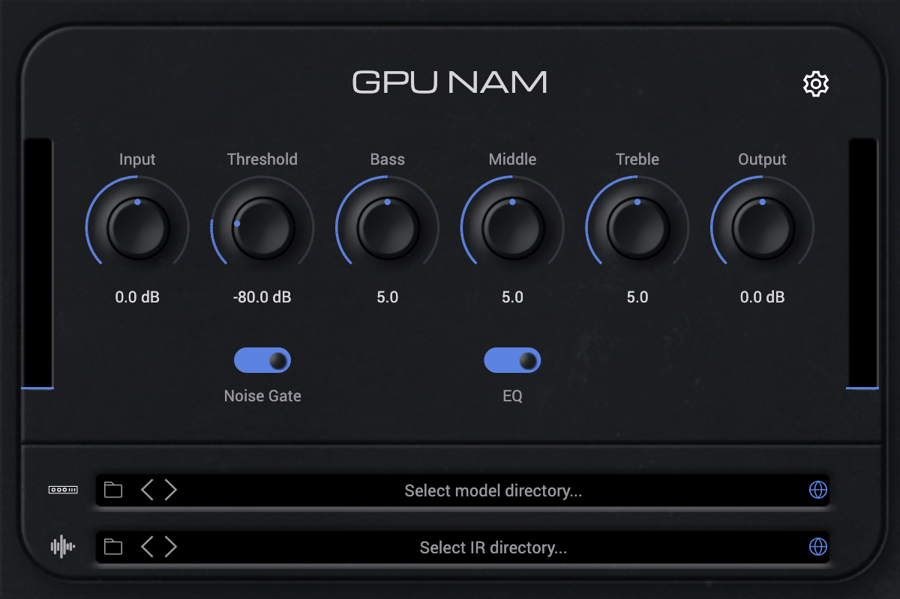

# GPU NAM

A [Neural Amp Modeler](https://github.com/sdatkinson/neural-amp-modeler) (`.nam`)
player that runs amp captures on the **GPU**, built on
[Pulp](https://github.com/danielraffel/pulp). Signed and notarized for macOS
(Apple Silicon).



## What it is

Load a `.nam` capture — the neural "fingerprint" of a guitar amp — and GPU NAM
runs its WaveNet inference to reamp your signal through that amp. It runs the
network on the **CPU by default**, with an opt-in **GPU engine** that runs the
exact same model on the GPU. A small example model is bundled so it works out of
the box; load your own `.nam` files for real amp tones.

It also loads other capture families — WaveNet (A1/A2), ConvNet, Linear, and LSTM
`.nam` models, plus RTNeural/Keras (`.json`) GRU/LSTM — all through one CPU
inference substrate; the feedforward WaveNet family is what the GPU engine
accelerates.

## An honest take on neural amps on the GPU

This is the case the skeptics are usually right about — and the one place the
conventional wisdom is *wrong* if you do it correctly.

**Done naively, GPU neural-amp inference is terrible.** If you run the network one
sample at a time, every sample pays a CPU↔GPU round-trip (hundreds of
microseconds against ~0.1 µs of actual work) — thousands of times slower than the
CPU. That's why "run NAM on the GPU" has a bad reputation.

**Done right, it wins — and the win grows with model size.** The WaveNet family is
feedforward, so a whole block's output samples can be computed in parallel; the
entire forward pass is fused into one GPU submission over device-resident weights,
and the CPU↔GPU round-trip is paid **once per block**, not per sample or per
layer. At small models the CPU is still faster (the round-trip dominates); as the
capture grows, the GPU's parallelism pulls ahead while the CPU falls behind
real time. The bundled example is small, so **the CPU engine is the honest default
here** — the GPU engine is there to switch on for large captures and to show the
architecture. Both are validated bit-for-bit against each other.

## Install (macOS, Apple Silicon)

Download the signed, notarized installer from the
[**Releases**](https://github.com/danielraffel/pulp-gpu-nam/releases) page and run
it. The installer offers a **Customize** pane so you can pick which formats to
install:

- **AU** → `~/Library/Audio/Plug-Ins/Components/`
- **VST3** → `~/Library/Audio/Plug-Ins/VST3/`
- **CLAP** → `~/Library/Audio/Plug-Ins/CLAP/`
- **Standalone** app

Then rescan plugins in your DAW. A default `example.nam` capture ships inside the
bundle, so the plugin makes sound immediately; load your own `.nam` from the model
slot for real amp tones.

**Model & cabinet slots.** Click a slot to open a file picker, or use the
**‹ / ›** arrows to step through the other captures in the same folder (any
architecture — WaveNet, ConvNet, Linear, LSTM, or an RTNeural/Keras `.json` — is
detected automatically as you browse). The right-edge glyph clears the slot: the
model reverts to the bundled default; the cabinet IR turns off. The IR slot works
the same way for `.wav`/`.aiff`/`.flac` cabinets and swaps click-free while audio
runs.

## Build from source

GPU NAM builds against the Pulp SDK, vendored here as a git submodule at `./pulp`.

**Requirements:** macOS (Apple Silicon), CMake ≥ 3.24, a C++20 toolchain (Xcode
command-line tools). The GPU stack (Dawn + Skia Graphite) is fetched/prebuilt by
Pulp's own build.

```bash
# 1. Clone with the Pulp submodule
git clone https://github.com/danielraffel/pulp-gpu-nam.git
cd pulp-gpu-nam
git submodule update --init --recursive

# 2. (Optional) Fetch the VST3 + AU SDKs. CLAP and the Standalone app build
#    without any external SDK; run this only if you want the VST3 and/or AU
#    formats. They're developer-supplied and not vendored here.
./scripts/fetch-sdks.sh

# 3. Configure (Release; the GPU stack is required)
cmake -S . -B build -DCMAKE_BUILD_TYPE=Release

# 4. Build the plugin + the standalone app (drop the formats you didn't fetch
#    an SDK for)
cmake --build build --target GpuNam_Standalone GpuNam_CLAP GpuNam_VST3 GpuNam_AU \
      -j$(sysctl -n hw.ncpu)
```

Pulp is built lean from the submodule (its own examples, tests, and CLIs are
skipped when it's consumed this way); the first build compiles the Pulp SDK, so
it takes a while. CLAP + Standalone need no external SDK.

Build products land under `build/` (`CLAP/GpuNam.clap`, `VST3/GpuNam.vst3`,
`AU/GpuNam.component`, and the standalone app). The bundles are self-contained and
relocatable — the build fails if any bundle bakes a build-tree dylib path.

### Smaller builds

Each capture family is a build toggle — drop the ones you don't need:

```bash
cmake -S . -B build -DGPU_NAM_WITH_LSTM=OFF -DGPU_NAM_WITH_KERAS=OFF
```

Toggles: `GPU_NAM_WITH_WAVENET` (A1), `_A2`, `_CONVNET`, `_LSTM`, `_LINEAR`,
`_KERAS`. The GPU engine is WaveNet-specific, so a build that turns WaveNet off
targets the CPU inference layer only.

### Package a signed installer

`src/package.sh` drives the signed + notarized combined installer (it calls
Pulp's `ship` tooling from the submodule). See the script header for the
signing-identity and notary-key environment it expects.

## Tests

GPU NAM ships its own test suite (it fetches a private Catch2; it does not turn on
Pulp's whole test tree):

```bash
cmake -S . -B build -DCMAKE_BUILD_TYPE=Release -DGPU_NAM_BUILD_TESTS=ON
cmake --build build -j$(sysctl -n hw.ncpu)
ctest --test-dir build -R gpu-nam --output-on-failure
```

- `gpu-nam-gpu-test` — the fused GPU WaveNet reproduces the CPU oracle (single
  block, streaming, and wins at scale).
- `gpu-nam-plugin-test` — CPU/GPU engines produce finite amped audio, bypass is
  the dry signal, the Engine switch is live at fixed latency, the noise gate
  attenuates sub-threshold signal, the tone stack is transparent when flat.
- `gpu-nam-{model,a2,convnet,lstm,linear,keras}-test` — each capture family loads
  and runs.
- `gpu-nam-ui-test` — the editor renders non-blank and asset-composited, and
  pointer input drives real parameters.

## How it's built on Pulp

GPU NAM is a plain Pulp plugin (`Processor` + a native view). The only Pulp
capability specific to this kind of work is the GPU inference primitive —
`pulp::render::GpuCompute::prepare_wavenet` / `wavenet_forward` — a general fused,
block-parallel, conditioned-WaveNet forward that lives in the Pulp SDK. This repo
owns the `.nam` / Keras format loaders, the CPU oracle, the tone stack and gate,
the editor, and the format packaging; the framework owns rendering, the audio
graph, and the GPU primitive. The integration boundary is deliberately thin: the
plugin depends only on Pulp's public targets (`pulp::render`, `pulp::gpu-audio`,
`pulp::signal`, `pulp::view`, `pulp::canvas`, `pulp::runtime`).

## Repository layout

```
pulp-gpu-nam/
├── pulp/              # Pulp SDK (git submodule, pinned)
├── src/               # the plugin: loaders, CPU oracle, GPU glue, editor, tests
│   ├── models/        # bundled example.nam
│   ├── assets/nam/    # editor image + font assets (see ATTRIBUTION.md)
│   └── docs/          # editor screenshot, CPU-vs-GPU comparison notes
├── CMakeLists.txt     # top-level: build Pulp lean, then the plugin
└── README.md
```

## Attribution & license

GPU NAM is MIT-licensed (see [`LICENSE.md`](LICENSE.md)). The editor is an
independent recreation of
[NeuralAmpModelerPlugin](https://github.com/sdatkinson/NeuralAmpModelerPlugin)'s
face panel in Pulp's view/canvas — none of that plugin's UI code is used. Its
image and font assets are reused under their own MIT/OFL/Apache licenses; see
[`src/assets/nam/ATTRIBUTION.md`](src/assets/nam/ATTRIBUTION.md). The
"Neural Amp Modeler" name and wordmark are trademarks and are not used as
branding — the demo is titled neutrally.
